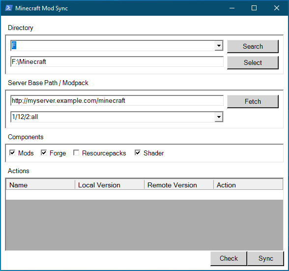

# McModsync

A graphical Powershell tool to synchronize Minecraft mods from server to local.

McModsync is a simple Powershell script for Microsoft Windows, that helps maintaining Minecraft mods at client side.
It provides a Windows Forms based GUI for better usability.



- [McModsync](#mcmodsync)
  - [Usage](#usage)
    - [Client side usage](#client-side-usage)
      - [Directory](#directory)
      - [URL / Modpack](#url--modpack)
      - [Components](#components)
      - [Actions](#actions)
      - [Check and Sync](#check-and-sync)
    - [Attention](#attention)
    - [Add client side mods](#add-client-side-mods)
  - [Server setup](#server-setup)
    - [.info file](#info-file)
    - [.listing file](#listing-file)

## Usage

This tool assumes there is a web server somewhere, providing all mods in a certain structure. More on server side setup in [server setup](#server-setup).

### Client side usage

In the following paragraphs, all parameters of McModsync are explained.

#### Directory

This is the target directory, where mods will be installed.
Actually it is the base directory, where the Minecraft game files are installed.
The *MinecraftLauncher.exe* is located in there.

Either write the path into the lower box manually and press *Select* button, or choose the volume from dropdown and search for the installation directory automatically.

#### URL / Modpack

This is where the server base URL needs to be entered into the upper box.
Upon pressing *Fetch*, McModsync will try to fetch a list of available modpacks from the server, which can then be chosen from the dropdown.

#### Components

This is where the components to synchronize are selected.

#### Actions

In this table, all mods requiring an action are listed.
These actions can be one of *ADD*, *UPDATE*, *DELETE*.

#### Check and Sync

By pressing the *Check* button after fetching modpacks, McModsync compares the local mod list with the remote one, and determines which actions are required for each mod.
When pressing *Sync* button **- after *Check* -** it will download all selected components if necessary and take listed actions for mods.

### Attention

McModsync will create a folder **tmp** inside the Minecraft installation directory, where all files are downloaded to.
If selected, the forge installer is located inside this folder too after *Sync*.

Resourcepacks and shaderpacks are not related to a certain modset, hence they are overridden every time on *Sync*, unless they are not selected in the GUI.

Minecraft mods are located in a folder **mods**.
When syncing a modset with McModsync a file **.listing** is placed in there.
**Do not modify this file!**
It is used to keep state of installed mods.
When syncing a different modpack, all mods in this folder are removed permanently.
You need to take backups on your own.

### Add client side mods

Mods that are just placed into the *mods* folder are not affected by the synchronization process, as only the ones listed in *.listing* are maintained.

## Server setup

As server any web server (nginx, apache, ...) can be used.
The following directory structure is required to be accessible by any client.

```txt
/.info
/resourcepacks.zip
/shaderpacks.zip
/<major version>
    /<minor version>
        /<bugfix version>
            /<modpack>
                /.listing
                /forge-installer.exe
                /<mod (.jar) files ...>
```

**Example:**

```txt
/.info
/resourcepacks.zip
/shaderpacks.zip
/1
    /12
        /2
            /all
                /.listing
                /forge-installer.exe
                /mod.jar
```

### .info file

Line sepparated list of all available modpacks.

**Format:**

```txt
majer version/minor version/bugfix version:modpack
```

**Example:**

```txt
1/12/2:all
1/13/1:tech
```

### .listing file

Line sepparated list of all mods in this particular pack.

**Format:**

```txt
file:version
```

**Example:**

```txt
SomeMod.jar:1.0
another_mod.jar:1.1
```
